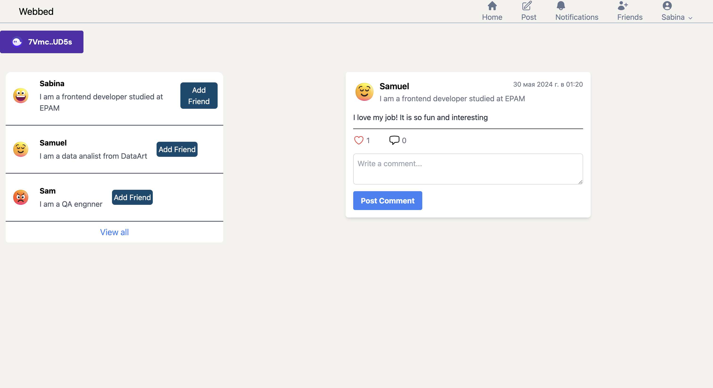
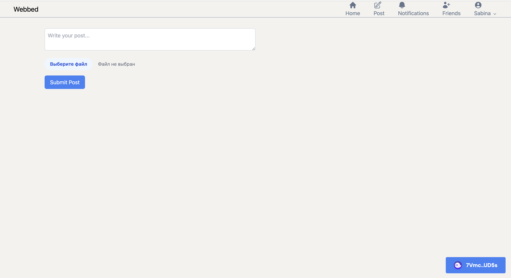
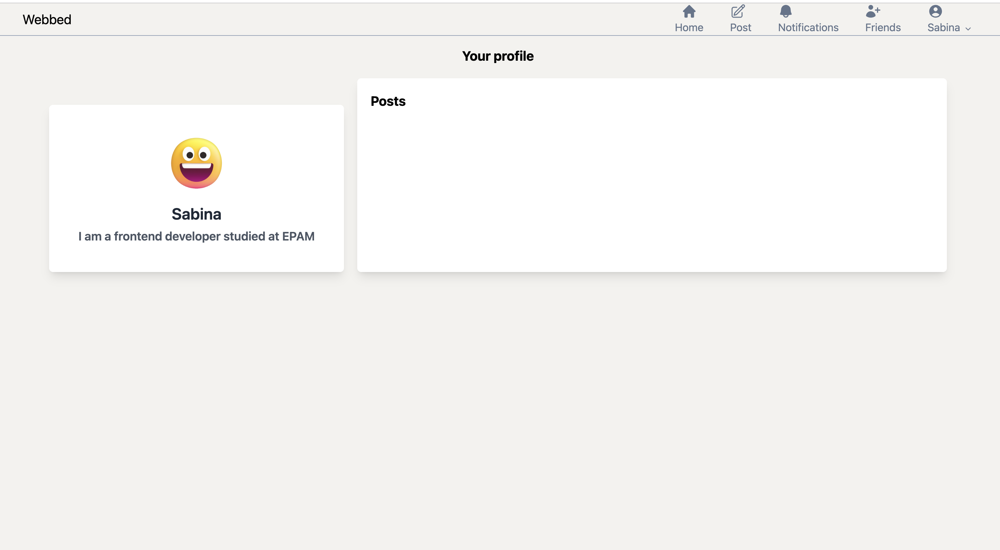
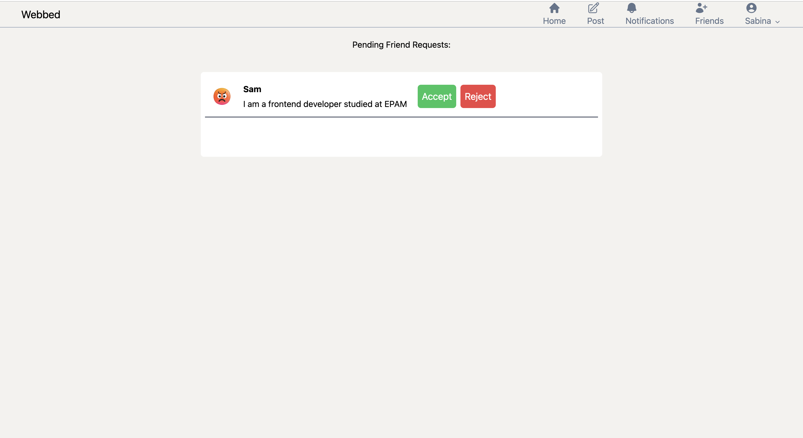

# Decentralized Professional Networking Platform

## Overview

This project aims to build a decentralized professional networking platform using the Solana blockchain. The platform allows users to create profiles, connect with other professionals, and showcase their skills and experiences. The primary goal is to create a web3 LinkedIn-like application where users have control over their data, and interactions are facilitated through smart contracts.

## Features

- User Profiles: Users can create and manage their professional profiles.
- Connections: Users can connect with other professionals in the network.
- Decentralized Data Control: Users have control over their data, ensuring privacy and security.
- Smart Contracts: All interactions are handled through smart contracts on the Solana blockchain.

## Tech Stack

- Blockchain: Solana
- Frontend: Next.js
- Smart Contracts: Rust (for Solana programs)
- Authentication: Wallet-based authentication (e.g., Phantom wallet)

## Getting Started

### Prerequisites

- npm installed
- Solana CLI installed
- Phantom wallet (or any Solana-compatible wallet)

### Installation

1. Clone the repository:
   

        git clone https://github.com/Sabinakass/webbed.git
         cd webbed/
   

2. Go to the directory "app":

cd app/

3. Install the dependencies "app":

npm install

3. Run :

npm run dev

and go to the [http://localhost:3000]

### Project Demo

